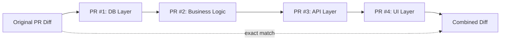
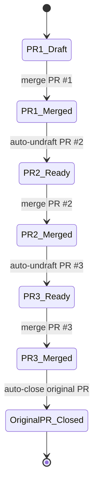

# prsplit

A CLI tool that automatically splits large Pull Requests into review-friendly chained PRs using AI.

## Problem

Reviewing PRs with many file changes is a heavy burden for reviewers. `prsplit` analyzes the diff of an existing PR with AI (Claude / Codex), automatically splits it into reviewable units, and creates draft PRs.

## Features

- **Layer-based splitting**: Splits PRs in order: DB -> business logic -> API -> UI
- **Chained PRs**: Split PRs have dependencies, enabling ordered review and merge
- **Automated workflow**: GitHub Actions monitors merges and automatically undrafts the next PR
- **Interactive**: If you do not like the split plan, add instructions and regenerate
- **Exact-match guarantee**: The combined diff of all merged split PRs exactly matches the original PR
- **English output**: Generated PR titles/descriptions and CLI errors/messages are output in English

## Installation

```bash
npm install -g prsplit
```

**Requirements**: Node.js 20+

## Setup

Set the following environment variables:

```bash
# Required
export GITHUB_TOKEN=ghp_xxxxx

# If using Claude (default)
export ANTHROPIC_API_KEY=sk-ant-xxxxx

# If using Codex (OpenAI)
export OPENAI_API_KEY=sk-xxxxx
```

## Usage

### Basic usage

```bash
# Specify by PR number (uses repository in current directory)
prsplit 123

# Specify by PR URL
prsplit https://github.com/owner/repo/pull/123
```

### Options

```bash
prsplit <PR number or URL>
  --prompt "additional instructions" # Guide split direction
  --model claude|openai              # AI model to use (default: claude)
  --dry-run                          # Show split plan only; do not create PRs
```

### Example run

```
$ prsplit 123
✓ Generated split plan (3 PRs)
  1. feat/xxx-db-layer (4 files)
     feat: add database migrations and models
  2. feat/xxx-business-logic (6 files)
     feat: implement business logic
  3. feat/xxx-api-layer (3 files)
     feat: add API endpoints

Do you like this plan? (y/n): n
✓ Deleted draft PRs
Enter instructions for rerun: split the logic layer into smaller PRs
✓ Generated split plan (4 PRs)
...
```

### Dry-run mode

```bash
prsplit 123 --dry-run
# -> Shows split plan only. No PRs are created.
```

### Switch model

```bash
prsplit 123 --model openai
```

## Splitting rules

1. **Default strategy**: Layer-based (DB -> logic -> API -> UI)
2. **Fallback**: If layer structure is unclear, AI decides
3. **Chain dependency**: Each split PR is based on the previous PR branch
4. **Exact match**: Sum of all split PR diffs = original PR diff



## Merge flow

```
PR #1 (DB)    -> merge -> undraft PR #2 (Logic)
PR #2 (Logic) -> merge -> undraft PR #3 (API)
PR #3 (API)   -> merge -> automatically close original PR
```

A GitHub Actions workflow is generated automatically. It detects when the previous PR is merged and undrafts the next PR.



## Original PR behavior

- The original PR is automatically closed after all split PRs are merged
- The original PR branch remains (for verification)
- Each split PR description includes the original PR branch name

## Development

```bash
git clone https://github.com/prsplit/prsplit
cd prsplit
npm install
npm run build

# Run in development mode
npm run dev -- 123

# Run tests
npm test
```

## License

MIT
