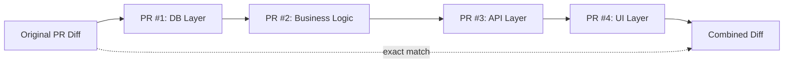
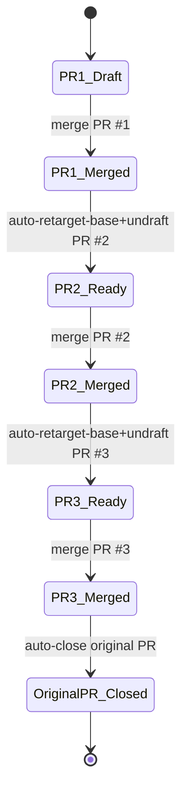

# prsplit

A CLI tool that automatically splits large Pull Requests into review-friendly chained PRs using AI.

## Problem

Reviewing PRs with many file changes is a heavy burden for reviewers. `prsplit` analyzes the diff of an existing PR with AI (Claude / Codex), automatically splits it into reviewable units, and creates draft PRs.

## Features

- **Layer-based splitting**: Splits PRs in order: DB -> business logic -> API -> UI
- **Chained PRs**: Split PRs have dependencies, enabling ordered review and merge
- **Automated workflow**: GitHub Actions monitors merges, retargets the next PR base to the original base branch, automatically undrafts it, and cleans up generated chain workflows after completion
- **Interactive**: If you do not like the split plan, add instructions and regenerate
- **Exact-match assurance**: Changed files are covered exactly once across split PRs and reconstructed in chain order
- **English output**: Generated PR titles/descriptions and CLI errors/messages are output in English

## Installation

```bash
npm i @kmjt000/prsplit
```

**Requirements**: Node.js 20+

## Setup

Set the following environment variables:

```bash
# Required
export GITHUB_TOKEN=your_github_token

# If using Claude (default)
export ANTHROPIC_API_KEY=sk-ant-xxxxx

# If using Codex (OpenAI)
export OPENAI_API_KEY=sk-xxxxx
```

Security and reliability notes:

- Do not commit tokens to source control or paste them in issue/PR comments.
- Prefer a secret manager (for example, 1Password CLI, macOS Keychain integration, or CI secrets) over shell history.
- Use a fine-grained GitHub token with minimum required repository permissions:
  - `Contents`: Read and write
  - `Pull requests`: Read and write
  - `Workflows`: Read and write (required when committing generated workflow files)
- Key requirements by model:
  - `--model claude` (default): requires `ANTHROPIC_API_KEY`
  - `--model codex`: requires `OPENAI_API_KEY`

## Usage

### Basic usage

```bash
# Specify by PR number (uses repository in current directory)
prsplit 123

# Specify by PR URL
prsplit https://github.com/owner/repo/pull/123
```

### Options

```bash
# Split command (default; `split` can be omitted)
prsplit [split] <PR number or URL>
  --prompt "additional instructions" # Guide split direction
  --model claude|codex               # AI model to use (default: claude)
  --dry-run                          # Show split plan only; do not create PRs

# Cleanup generated draft PRs for an original PR
prsplit cleanup <PR number or URL>
```

### Example run

```
$ prsplit 123
✓ Generated split plan (4 PRs)
  1. feat/xxx-db-layer (4 files)
     feat: add database migrations and models
  2. feat/xxx-business-logic (6 files)
     feat: implement business logic
  3. feat/xxx-api-layer (3 files)
     feat: add API endpoints
  4. feat/xxx-ui-layer (2 files)
     feat: implement UI changes

Do you want to proceed? (y/n): n
Enter instructions to regenerate the split: split the logic layer into smaller PRs
✓ Generated split plan (5 PRs)
...
```

### Dry-run mode

```bash
prsplit 123 --dry-run
# -> Shows split plan only. No PRs are created.
```

### Switch model

```bash
prsplit 123 --model codex
```

### Close draft split PRs

Close draft split PRs generated by `prsplit` for a specific original PR:

```bash
prsplit cleanup 123
prsplit cleanup https://github.com/owner/repo/pull/123
```

Cleanup targets are limited to PRs that match **all** conditions below:

- Open PR in draft state
- PR body contains the matching `Original PR` metadata row (same original PR number)
- PR body contains the `prsplit` generated footer (`This PR was automatically generated by [prsplit]`)

Each target PR is closed and its branch is deleted after confirmation.

## Splitting rules

1. **Default strategy**: Layer-based (DB -> logic -> API -> UI)
2. **Fallback**: If layer structure is unclear, AI decides
3. **Chain dependency**: Each split PR is based on the previous PR branch
4. **Exact match**: Sum of all split PR diffs = original PR diff



## Merge flow

```
PR #1 (DB)    -> merge -> undraft PR #2 (Logic)
PR #2 (Logic) -> merge -> undraft PR #3 (API)
PR #3 (API)   -> merge -> automatically close original PR
```

A GitHub Actions workflow is generated automatically. It detects when the previous PR is merged and undrafts the next PR.



## Original PR behavior

- The original PR is automatically closed after all split PRs are merged
- The original PR branch remains (for verification)
- Each split PR description includes the original PR branch name

## Development

```bash
git clone https://github.com/prsplit/prsplit
cd prsplit
npm install
npm run build

# Run in development mode
npm run dev -- 123

# Run unit + integration tests (default)
npm test

# Run integration tests only
npm run test:integration

# Run real LLM tests (requires real API keys + PR input)
export GITHUB_TOKEN=ghp_xxxxx
export ANTHROPIC_API_KEY=sk-ant-xxxxx
export OPENAI_API_KEY=sk-xxxxx
export PRSPLIT_TEST_PR=https://github.com/owner/repo/pull/123
npm run test:llm

# Run manual GitHub E2E preflight checks
export PRSPLIT_TEST_REPO_FULL_NAME=owner/repo
npm run test:github:manual
```

### Test layers

- `npm test`: unit + integration (`tests/e2e/**` is excluded)
- `npm run test:llm`: real LLM integration (Claude + Codex), invariant-based assertions
- `npm run test:github:manual`: preflight for manual GitHub side-effect E2E

For the full manual GitHub E2E checklist (split -> merge chain -> cleanup), see:

- [docs/manual-github-e2e.md](docs/manual-github-e2e.md)

## License

MIT
