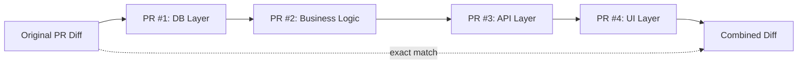
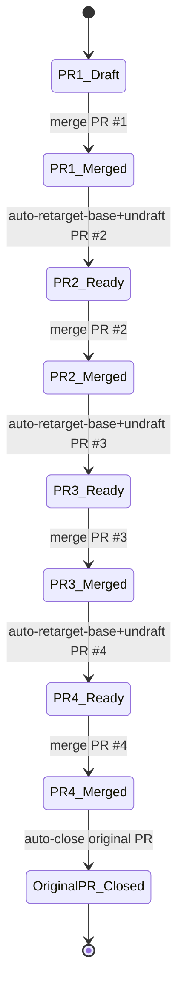

# prsplit

A CLI tool that automatically splits large Pull Requests into review-friendly chained PRs using AI.

## Problem

Reviewing PRs with many file changes is a heavy burden for reviewers. `prsplit` analyzes the diff of an existing PR with AI (Claude / Codex), automatically splits it into reviewable units, and creates draft PRs.

## Features

- **Layer-based splitting**: Splits PRs in order: DB -> business logic -> API -> UI
- **Chained PRs**: Split PRs have dependencies, enabling ordered review and merge
- **Automated workflow**: GitHub Actions monitors merges, retargets the next PR base to the original base branch, automatically undrafts it, and cleans up generated chain workflows after completion
- **Interactive**: If you do not like the split plan, add instructions and regenerate
- **Exact-match assurance**: Changed files are covered exactly once across split PRs and reconstructed in chain order
- **Per-branch CI gate with AI repair**: Before creating each split PR, prsplit waits for `build-and-test` (`CI` workflow on push). If it fails, AI moves minimal dependency files from later parts and retries up to 3 times
- **Auto-collapse with final renumbering**: If CI repair makes later parts empty, prsplit collapses them and renumbers created PRs to a contiguous review order (`1/M..M/M`)
- **English output**: Generated PR titles/descriptions and CLI errors/messages are output in English

## Installation

```bash
npm install -g prsplit
```

**Requirements**: Node.js 20+

## Setup

Set the following environment variables:

```bash
# Required
export GITHUB_TOKEN=your_github_token

# If using Claude (default)
export ANTHROPIC_API_KEY=sk-ant-xxxxx

# If using Codex (OpenAI)
export OPENAI_API_KEY=sk-xxxxx
```

Security and reliability notes:

- Do not commit tokens to source control or paste them in issue/PR comments.
- Prefer a secret manager (for example, 1Password CLI, macOS Keychain integration, or CI secrets) over shell history.
- Use a fine-grained GitHub token with minimum required repository permissions:
  - `Contents`: Read and write
  - `Pull requests`: Read and write
  - `Workflows`: Read and write (required when committing generated workflow files)
- Key requirements by model:
  - `--model claude` (default): requires `ANTHROPIC_API_KEY`
  - `--model codex`: requires `OPENAI_API_KEY`

## Usage

### Basic usage

```bash
# Specify by PR number (uses repository in current directory)
prsplit 123

# Specify by PR URL
prsplit https://github.com/owner/repo/pull/123
```

### Options

```bash
# Split command (default; `split` can be omitted)
prsplit [split] <PR number or URL>
  --prompt "additional instructions" # Guide split direction
  --model claude|codex               # AI model to use (default: claude)
  --dry-run                          # Show split plan only; do not create PRs

# Cleanup generated draft PRs for an original PR
prsplit cleanup <PR number or URL>
```

### Example run

```
$ prsplit 123
✓ Generated split plan (4 PRs)
  1. feat/xxx-db-layer (4 files)
     feat: add database migrations and models
  2. feat/xxx-business-logic (6 files)
     feat: implement business logic
  3. feat/xxx-api-layer (3 files)
     feat: add API endpoints
  4. feat/xxx-ui-layer (2 files)
     feat: implement UI changes

Do you want to proceed? (y/n): n
Enter instructions to regenerate the split: split the logic layer into smaller PRs
✓ Generated split plan (5 PRs)
...
```

### Dry-run mode

```bash
prsplit 123 --dry-run
# -> Shows split plan only. No PRs are created.
```

### Switch model

```bash
prsplit 123 --model codex
```

### Close draft split PRs

Close draft split PRs generated by `prsplit` for a specific original PR:

```bash
prsplit cleanup 123
prsplit cleanup https://github.com/owner/repo/pull/123
```

Cleanup targets are limited to PRs that match **all** conditions below:

- Open PR in draft state
- PR body contains the matching `Original PR` metadata row (same original PR number)
- PR body contains the `prsplit` generated footer (`This PR was automatically generated by [prsplit]`)

Each target PR is closed and its branch is deleted after confirmation.

## Splitting rules

1. **Default strategy**: Layer-based (DB -> logic -> API -> UI)
2. **Fallback**: If layer structure is unclear, AI decides
3. **Chain dependency**: Each split PR is initially based on the previous PR branch
4. **File-level exactness**: Every changed file belongs to exactly one split PR, and the chain reconstructs the original PR head state



### Built-in validation

Before PR creation, `prsplit` validates that:

- All files from the original PR are included in the split result
- No file appears in multiple split PRs
- Split PR order is sequential (`1..N`)
- Relative `.js` imports in changed TypeScript files resolve on each generated split branch
- `build-and-test` on each split branch passes before the PR is created (with AI-assisted repair retries up to 3 times)
- If CI repair moves files forward and empties a later part, that part is auto-collapsed and the final created PRs are re-labeled to contiguous order

### Optional manual verification

After generating split branches, you can compare the original PR branch and the last split branch:

```bash
# 1) Verify changed-file set consistency from the same base
git diff --name-status <base_branch>..<original_pr_branch>
git diff --name-status <base_branch>..<last_split_branch>

# 2) Verify final content equivalence
git diff --stat <original_pr_branch>..<last_split_branch>
```

If the last command shows no changes, the final split chain matches the original PR branch content.

## Merge flow

```
PR #1 (DB)    -> merge -> retarget + undraft PR #2 (Logic)
PR #2 (Logic) -> merge -> retarget + undraft PR #3 (API)
PR #3 (API)   -> merge -> retarget + undraft PR #4 (UI)
PR #4 (UI)    -> merge -> automatically close original PR
```

A GitHub Actions workflow is generated automatically. It detects when the previous PR is merged, updates the next PR base branch to match the original PR base branch, and undrafts the next PR. After the final split PR is merged, it closes the original PR and removes only the chain workflow files generated for that split run.

### Workflow prerequisites

- GitHub Actions must be enabled on the repository.
- The token used by `prsplit` must have permission to create branches/PRs and commit workflow files.
- Workflow jobs require `pull-requests: write` and `contents: write` to retarget PR bases, close the original PR, and delete generated workflow files.
- A push-triggered workflow named `CI` must run `build-and-test` (for example: `npm run build` and `npm test`) because `prsplit` waits for that workflow before opening each split PR.
- If branch protection blocks base retargeting or automation on split branches, retarget/undraft/close/cleanup automation may fail.
- If automation cannot run, you can still merge split PRs manually in order.



## Original PR behavior

- The original PR is automatically closed after all split PRs are merged
- The original PR branch remains (for verification)
- Each split PR description includes the original PR branch name

## Development

```bash
git clone https://github.com/prsplit/prsplit
cd prsplit
npm install
npm run build

# Run in development mode
npm run dev -- 123

# Run tests
npm test
```

## License

MIT
